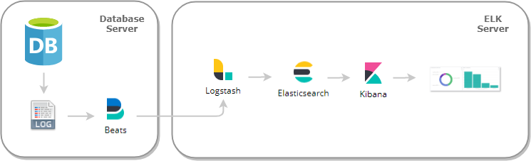
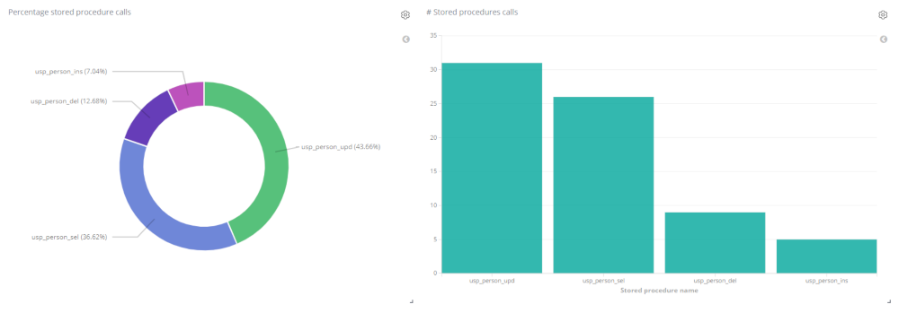

# mysql-log-analysis-ELK

**mysql-log-analysis-ELK** means the first step aimed at an implementation of a simple and non-intrusive system to monitor databases using the Elastic Stack (ELK-Stack).

The main goal of this project is just to give a first approach to those who want to learn about all Elasticsearch tools might offer to collect and analyze data coming from log files. Feel free to adapt it to meet yor needs. 

The Elastic products you will find are:

- **Elastisearch** (database engine)
- **Logstash** (filtering and data transformation)
- **Kibana** (visualization)
- **Filebeat** (collect data from log file)

As for database engine, MySQL has been selected because its ease to install and start-up. Moreover, it provides us with an uncomplicated way of handling log files. 

Take a look at the diagram below with the different elements in the process:



To focus on the orchestration of all actors involved, only stored procedure calls in the database are tracked. Those stored procedures, as we will see later on and to make easier their tracking, follow always the naming convention:
```
[DATABASE].usp_*
```
A typical MySQL statement to call a user stored procedure in this project might look like this:
```
CALL [DATABASE].usp_*([parameter,[,....]])
```
This string is what our system will monitor, along with its execution time and session id, only that information is relevant for us in this project, the rest is ruled out. The point is to get statistics on **business logic usage** which the database is offering. Is it too contrived? Surely not!. 
 
## Requirements

Ideally, you should work at least with two servers: **Database Server** and **ELK Server**. Even you could install the Elastic tools into a more complex (and real) architecture with an Elasticsearch cluster consisting of several nodes, a dedicated server for data visualization purposes, and so on. However, do not forget that, our aim with this project is to learn, that is why something as simple as only a **virtual machine** with **Ubuntu Server** would be more than enough.

When it comes to applications, all of them are free open source and easily accessible on the Internet.     

## Installation

The installation process for all tools is going to be described in detail, step by step. Our starting point will be a clean **Ubuntu Server 18.04** virtual machine (Oracle VM VirtualBox). Along with the set-up of those tools, you will find all the changes into their configuration to connect them and make them work together.

A logical installation order is followed, anyway, feel free to do it differently

### MySQL
Install MySQL
```
$ sudo apt-get update && sudo apt-get install mysql-server
```
Run this utility to set a password for `root` account, remove test database, and so on
```
$ sudo mysql_secure_installation
```
Test installation is OK
```
$ sudo /bin/systemctl status mysql
``` 
Check you can access using mysql client
```
$ sudo mysql -u root -pXXXXX
```
By default, logging on MySQL is disabled. You can enable it with this SQL statement
```
mysql> set global general_log = 'ON';
```
If you want to make this option permanent, you should modify the configuration file 
```
/etc/mysql/mysql.cnf
```
adding this line in `mysqld` section
```
[mysqld]
general-log = 1
```
After this change in the configuration file, MySQL service must be restarted
```
$ sudo service mysql restart
```
From now on MySQL will leave a trace in the log file `/var/lib/mysql/ubuntu.log`, you can confirm this file with the SQL statement
```
mysql> show variables like '%general_log%';
```

### Elasticsearch

Elasticsearch is the heart of the so called **Elastic Stack**. It serves as a central data store which receives in this project solely information filtered through pipelines Logstash and Filebeat. 

Before starting, you may need to install the package `apt-transport-https`
```
$ sudo apt-get install apt-transport-https
```
Check your present Java version because perhaps yours is different from Java 8 or Java 11, which **Elasticsearch** needs
```
$ java -version
``` 
In case of several JMV on your system, use this command to change it and select the version 8 or 11
```
$ sudo update-alternatives --config java
```
Elasticsearch signs all its installation packages with a PGP key, first of all, download and install that key
```
$ wget -qO - https://artifacts.elastic.co/GPG-KEY-elasticsearch | sudo apt-key add -
``` 
Save the repository definition
```
$ echo "deb https://artifacts.elastic.co/packages/7.x/apt stable main" | sudo tee -a /etc/apt/sources.list.d/elastic-7.x.list
```
Install Elasticsearch
```
$ sudo apt-get update && sudo apt-get install elasticsearch
```
Some changes shoudl be made in file `/etc/elasticsearch/elasticsearch.yml`. The first one to bind to this server from any other IP
```
network.host: 0.0.0.0
```
The second one allows us to avoid the bootstrap checks, because it thinks we are in a production deployment
```
discovery.type: single-node
```
Enable and start the new service
```
$ sudo /bin/systemctl daemon-reload
$ sudo /bin/systemctl enable elasticsearch.service
$ sudo /bin/systemctl start elasticsearch.service
``` 
Test installation is OK and Elasticsearch service up. It could take a few minutes
```
$ /usr/bin/curl -XGET 'localhost:9200'
```
### Kibana

Once Elasticsearch has received the data, we need to somehow show its information in a friendly way, that is where Kibana comes in. Kibana is the visualization platform designed to work with Elastisearch.

Install Kibana 
```
$ sudo apt-get update && sudo apt-get install kibana
```
Modify its configuration editing the file `/etc/kibana/kibana.yml` to allow connections from remote users, it is not a prerequisite
```
server.hosts: "0.0.0.0"
```
Make sure Kibana is pointing at your Elasticsearch node, where the data you want to visualize are coming from.
```
elasticsearch.hosts: ["http://localhost:9200"]
```
Enable and start the new service
```
$ sudo /bin/systemctl daemon-reload
$ sudo /bin/systemctl enable kibana.service
$ sudo /bin/systemctl start kibana.service
```
Now you can access using any browser to your Kibana, using the URL below. It could take a few minutes
```
http://localhost:5601
```

### Logstash

Logstash is a data processing pipeline that can ingest data from several sources (in our case Filebeat), filter it, transform it, and send it to your final destination (Elasticsearch in this project). Do not worry about the sync between Logstash and Filebeat, they use a back-pressure sensitive control to prevent from congestion problems.

Install Logstash
```
$ sudo apt-get update && sudo apt-get install logstash
```
Copy the configuration file provided `ELK/mysql_log_from_filebeat.conf` into default configuration directory. The content of this file will be explained in [configuration files section](#details-about-configuration-files)
```
/etc/logstash/conf.d
```
Install `prune` Logstash plugin, you probably realized it is used in the former configuration file and it is not bundled my default
```
$ sudo /usr/share/logstash/bin/logstash-plugin install logstash-filter-prune
```
Check this plugin is installed
```
$ sudo /usr/share/logstash/bin/logstash-plugin list | grep prune
```

### Filebeat
Filebeat offers a lightweight way to read log files and ship data extracted from them, ensuring us at-least-once delivery. Filebeat agent has to be installed on the server which needs to monitor.

Install Filebeat
```
sudo apt-get update && sudo apt-get install filebeat
```
Do not forget the goal is to read MySQL logs, but Filebeat needs to know where those files are. Moreover, those logs will be filtered and sent to Logstash tool which will finally send to Elasticsearch. This can be done modifying the default configuration file `filebeat.yml` located at the directory
```
/etc/filebeat
```
Anyway, you can use the file provided `ELK/filebeat.yml` and overwrite the existing one. It is not a bad idea to backup the original file, just in case.

## Testing

Now, we only must give a little nudge to put this in motion. Below you can find a sample database schema with a few stored procedures already created, a simple Python project to call those stored procedures randomly, and steps to run everything.    

### Sample Database

The file `database-schema/database-creation.sql` is a script to create the database `learning` containing one empty table `person` and four simple stored procedures. You can run this script into your MySQL
```
$ sudo mysql -u root -pXXXX < database-creation.sql
```
You should also create a user for our tester application. This user is only allowed to execute stored procedures. Run the script `database-schema/connection-user.sql` into the database to create the user `learning-user` with only permissions to execute stored procedures
```
$ sudo mysql -u root -pXXXX < connection-user.sql
```
### Simulating a normal Database usage
In `tester/call-stored-procedures.py` you will find a Python script which connects to your former database and call those stored procedures in array `config.STORED_PROCEDURE_CALLS`. Once the script is run, it goes into an endless loop you can stop pressing `Ctrl-C`. During that time period, stored procedures are called in a random interval between 1 and `config.DB_MAX_SC_CALL_INTERVAL * 1000` milliseconds.

The code is very easy to read and there are many comments, it is not difficult to understand. However, keep in mind you should install `mysql-connector-python` before. It is very easy with `pip3`
```
sudo apt install python3-pip
sudo pip3 install mysql-connector-python
```
You could call our python code using the command below, but do not do it yet! 
```
python3 call-stored-procedures.py
```

### Starting off 

So far so good, but you probably realized we have done nothing other than installation and configuration tasks. This is the checklist to put everything in motion:

- [ ] MySQL server is up with `general_log` 'ON'
- [ ] Sample Database is imported
- [ ] Our special database user is created
- [ ] Elasticsearch is up
- [ ] Logstash is started manually using our conf file, it takes a while (run it in a new session, it is not a service!)
    ```
    $ sudo /usr/share/logstash/bin/logstash --path.settings /etc/logstash  -f "/etc/logstash/conf.d/mysql_log_from_filebeat.conf"
     ```    
- [ ] Filebeat is started manually
    ```
    $ sudo /bin/systemctl start filebeat.service
     ```
- [ ] Run `tester/call-stored-procedures.py` Python script, you can do it now
    ```
    python3 call-stored-procedures.py
    ```

Once our Python tester is running, the sequence of events is:
1. Our tester calls a stored procedure randomly
2. MySQL server receives that SQL statement and run it
3. New text lines are added into file `/etc/lib/mysql/ubuntu.log`
4. Filebeat agent detects changes in the log file, open it and take the new lines
5. Only new lines which match with the regular expression in the Filebeat configuration are sent to Logstash
6. Logstash receives those new lines, filter them, and take only those parts, it is interested in
7. Logstash sends to Elasticsearch those filtered and formatted data into a given index
8. Elasticsearch has created a new index which stores all Logstash send it

Opening a new session, you can run the command below to check the number of entries in Elasticsearch index `mysql_sp_track`. This number will increase by the tester calls 
``` 
$ /usr/bin/curl -XGET "http://localhost:9200/mysql_sp_track/_count?pretty=true"
```
You can show the first entries with command
``` 
$ /usr/bin/curl -XGET "http://localhost:9200/mysql_sp_track/_search?pretty=true"
```

Keep in mind, there is no problem to stop either Filebeat agent or Logstash for a while, after restarting they are able to resume just where they left off.

At this point, the new index `mysql_sp_track` has been created and loaded with some entries, you can stop the python tester and Logstash using `Ctrl-C`. Stop Filebeat with the command
```
sudo /bin/systemctl stop filebeat.service
``` 

### Kibana dashboard

As an image is worth more than one thousand words, it would be great to finish with a nice diagram showing the collected data in a friendly way. 

A Kibana configuration to visualize an index content is not a back-breaking task, however you can do it much easier importing a few files have been prepared for you. Please, it is important to do it in the order indicated, accessing to the Kibana server
```
http://localhost:5601
```
Going to
```
Management -> Saved Objects -> Import
```
You must import these files
```
ELK/index_pattern.ndjson
ELK/visualizations.ndjson
ELK/dashboard.ndjson
```
Once import is done, you should go to `Dashboard` section and search for `Stored procedures calls`. You will see something like this  
 


This dashboard is showing the use of the database on the basis of its stored procedures calls, just the challenge we set ourselves at the beginning of the project. 

Great job :smiley:!  

## Details about configuration files

### filebeat.yml

The Filebeat configuration file by default has been modified. Pay attention to the **Filebeat inputs** area. Firstly log input is enabled
```
- type: log
  enable: true
```
You should specify where the log files are located
```
  paths:
    - /var/lib/mysql/ubuntu.log
```
The scan frequency is now only 2 seconds 
```
  scan_frequency: 2s
```
Lines are filtered according to the regular expression below. Insensitive case is activated `(?i)`
```
  include_lines: ['(?i)call .*usp_']
```
Finally, where to send those text lines
```
output.logstash:
  hosts: ["localhost:5044"]
```
### mysql_log_from_filebeat.conf
Every Logstash configuration file usually has three sections: input, filter and output

**Input** is the port where Filebeat is sending its text lines
```
beats { 
    port => 5044 
}
``` 
**Filter** is the most tricky part. In this case two plugins are applied sequentially. With `grok` input is formatted
```
grok {
        match => { "message" => "(?i)%{TIMESTAMP_ISO8601:call_time}%{SPACE}%{NUMBER:session_id}%{SPACE}Query%{SPACE}call%{SPACE}learning.%{GREEDYDATA:sp_name}\(" }
}
```
After `grok` you need to pick up those fields you really want. Plugin `prune` is responsible for that
```
prune {
        whitelist_names => [ "call_time", "session_id", "sp_name" ]
}
```
**Output** is the final destination for the result of applying the former filters, in this case Elasticsearch. The index `mysql_sp_track` has not been created previously, Elasticsearch will do it before adding the first entry. 
```
elasticsearch {
        hosts => ["localhost:9200"]
        manage_template => false
        index => "mysql_sp_track"
}
```

